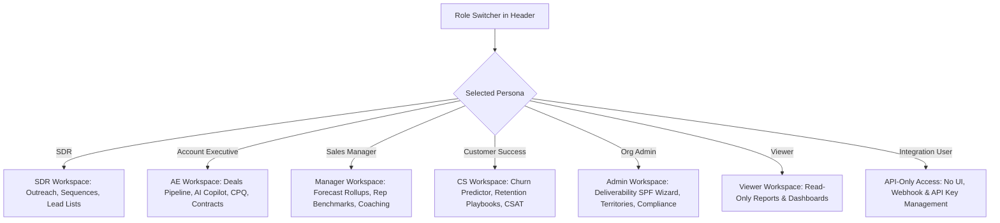

# Detailed Implementation Plan v2.0: Standalone Enterprise AI CRM + AI Outreach Engine

This document provides a fully comprehensive, module-by-module technical specification for building and aligning Zyntra with the v3.0 Standalone Enterprise Competitor BRD. Every requirement from the BRD — functional, operational, and non-functional — is mapped to concrete implementation tasks, files, data models, and verification checks. No third-party software dependencies.

---

## Table of Contents

1. [Core Architecture & Multi-Role Workspace Selector](#1-core-architecture--multi-role-workspace-selector)
2. [Pillar 1: AI CRM (Unified Deal Lifecycle)](#2-pillar-1-ai-crm-unified-deal-lifecycle)
3. [Pillar 2: AI Outreach Engine (Built-In Multi-Channel)](#3-pillar-2-ai-outreach-engine-built-in-multi-channel)
4. [Pillar 3: Built-In Data & Enrichment](#4-pillar-3-built-in-data--enrichment)
5. [Sales Operations & Admin Features](#5-sales-operations--admin-features)
6. [Advanced Features — Competitive Differentiation](#6-advanced-features--competitive-differentiation)
7. [Futuristic Features — The AI Moat](#7-futuristic-features--the-ai-moat)
8. [Non-Functional Requirements: Performance & Scalability](#8-non-functional-requirements-performance--scalability)
9. [Security, Compliance & Data Governance](#9-security-compliance--data-governance)
10. [Reliability, Disaster Recovery & Infrastructure](#10-reliability-disaster-recovery--infrastructure)
11. [Mobile — iOS & Android with Offline Capability](#11-mobile--ios--android-with-offline-capability)
12. [Verification & Rollout Plan](#12-verification--rollout-plan)

---

## 1. Core Architecture & Multi-Role Workspace Selector

To deliver the enterprise-grade RBAC requirements in the BRD, we build a global **Multi-Role Simulation System** rendering specific dashboards, modules, and controls per active persona.



### 1.1 Technical Specs: State Management & Navigation
- **File to Modify**: `src/App.tsx`
- **Role Selector UI**:
  - Premium glowing selection dropdown in the header with icons per role:
    - `Shield` for Org Admin
    - `TrendingUp` for Sales Manager
    - `Award` for Account Executive
    - `Send` for SDR
    - `HeartHandshake` for Customer Success
    - `Eye` for Viewer
    - `Webhook` for Integration User
  - Bind to `activeRole` React state; persist selection to `localStorage`.
- **Dynamic Sidebar and Tab Filtering**:
  - `SDR`: Outreach Cadences, Inbox, Leads list
  - `AE`: CRM Pipeline Board, Contracts & Quotes, AI Copilot
  - `Sales Manager`: Revenue Forecasting, Rep Coaching Library, Gamification boards
  - `Customer Success`: Churn Indicators, Account Health lists, SLA Escalations
  - `Org Admin`: Territory Assignment Map, Deliverability DKIM Wizard, System Audit Logs, Compliance Center
  - `Viewer`: Read-only Reports, Dashboards (no create/edit/send controls rendered)
  - `Integration User`: API Key management panel, Webhook event log, no main nav

### 1.2 Field-Level Security & RBAC Engine
- **New File**: `src/lib/rbac.ts`
- Define a `permissions` map: `{ role: string, module: string, actions: ('read'|'write'|'delete'|'export')[] }[]`
- Wrap every sensitive field (deal value, contract terms, salary data) in a `<FieldGuard role={activeRole} field="dealValue">` component that renders `••••••` for unauthorized roles.
- Implement a `usePermission(module, action)` hook used across all components to conditionally render buttons, forms, and tabs.
- Sensitive fields restricted by role: deal contract value (Viewer: hidden), rep quota targets (SDR: hidden), system audit logs (AE/SDR: hidden).

---

## 2. Pillar 1: AI CRM (Unified Deal Lifecycle)

### 2.1 Contact & Account Management

#### 2.1.1 Account Hierarchy & Org Structure
- **Files to Modify**: `src/components/CrmPipelineBoard.tsx`
- **New File**: `src/components/AccountHierarchyTree.tsx`
- Render a collapsible tree showing: **Parent Company → Subsidiaries → Business Units → Departments**.
- Each node shows: employee count, revenue band, assigned AE, deal count, and health badge.
- Clicking a subsidiary opens its own mini CRM view scoped to that entity.
- Support unlimited depth hierarchy with lazy-load for large enterprise accounts.

#### 2.1.2 Buying Committee Organogram
- Under the **Prospect Intelligence** tab (formerly Intel) in the right sidebar of the Lead/Deal details drawer, render an interactive org chart.
- Include a manual "Execute Intelligence" action that, when triggered, dynamically fetches and populates the details (firmographics, news, tech stack) for that particular lead.
- Reporting relationships: Parent company → Subsidiaries → Senior Executives → Operational stakeholders.
- Each node shows **Seniority & Influence Score**: Economic Buyer: 95%, Technical Champion: 80%, Influencer: 45%.
- Drag nodes to reassign relationships. Click a stakeholder to open their contact card inline.

#### 2.1.3 Smart Deduplication Engine
- **New File**: `src/lib/deduplication.ts`
- On every contact import or form submission, run a fuzzy-match algorithm against existing records using: email domain, full name Levenshtein distance (threshold ≤ 2), phone number normalization, and LinkedIn URL exact match.
- Surface a **Merge Suggestions** panel showing matched pairs with a confidence score (0–100%).
- Auto-merge records above 95% confidence; prompt user for 70–94%; ignore below 70%.
- Log all merge actions to the audit trail with `mergedBy`, `mergedAt`, and `originalRecords[]` payload.

#### 2.1.4 Auto-Enrichment Pipeline
- **New File**: `src/lib/enrichment.ts`
- On contact save, trigger background enrichment jobs pulling from:
  - Company website scraping (meta tags, LinkedIn company page)
  - Public records APIs (Crunchbase-compatible schema)
  - LinkedIn public profile data
- Show enrichment status badge: `Enriched`, `Partial`, `Failed` with retry button.
- Store enrichment source and timestamp for every enriched field for auditability.

#### 2.1.5 GDPR / CCPA Consent & Suppression Management
- **New File**: `src/components/ConsentManager.tsx`
- Each contact record includes a **Consent Panel** showing:
  - Consent type: Explicit, Legitimate Interest, or None
  - Consent date, source (web form, manual, import), and expiry
  - Suppression status: Active, Unsubscribed, Erasure Requested, Erased
- **Right-to-Erasure workflow**: Clicking "Request Erasure" triggers a confirmation, marks all records as PII-scrubbed, anonymizes name/email/phone, and logs the erasure event with timestamp and operator ID.
- **Data Portability export**: One-click export of all data for a contact as JSON/CSV in GDPR-compliant format.
- All consent events feed into the immutable **Audit Log** (see Section 9).

#### 2.1.6 Data Health Decay Monitor
- Visual badges (`Fresh`, `Stale`, `Decaying`) beside emails and phones.
- Auto-trigger warning alerts if a contact is uncontacted for more than 30 days.
- A **Data Quality Score** (0–100) shown on each contact, deducting points for: missing phone (−10), missing LinkedIn (−5), no activity in 60 days (−20), email bounced (−30).
- Bulk data hygiene panel: filter all contacts with score < 50, bulk-enrich or bulk-delete.

#### 2.1.7 Lead Import & Journey/Campaign Association
- **Files to Modify**: `src/components/SmartCsvImportModal.tsx`, `src/components/CrmPipelineBoard.tsx`
- Expand the CSV Importer wizard to include a **Campaign Association Step** after data validation.
- User options post-import:
  - **Option 1**: Add leads to an existing active campaign (Dropdown selector).
  - **Option 2**: Create a new campaign dynamically and assign leads to it.
- **Journey Visibility**: All imported leads must automatically appear as "Deals/Cards" in the `Unassigned` or first stage of the CRM Pipeline Board (Journey view), linked to their respective campaigns.

---

### 2.2 Pipeline & Deal Management

#### 2.2.1 Multi-Pipeline Support
- **Files to Modify**: `src/components/CrmPipelineBoard.tsx`
- Add a **Pipeline Switcher** dropdown in the board header supporting named pipelines:
  - New Business, Renewals, Upsells, Expansion, Partnerships
- Each pipeline has independently configurable stages, probability weights, and required fields.
- The Kanban board re-renders when switching pipelines. Cards show pipeline-specific fields (e.g., Renewals shows "Contract End Date"; Upsells shows "Expansion ARR").
- **Bulk Operations Toolbar**: appears when ≥2 cards are selected — supports bulk stage change, close date update, probability override, and reassign rep.

#### 2.2.2 Competitor Tracking per Deal
- Inside each deal drawer, add a **Competitors** tab.
- Reps log competing vendors per deal with fields: vendor name, evaluation status (Active/Eliminated/Unknown), notes.
- When a competitor is logged, the system auto-surfaces the relevant **battlecard** from the Competitive Intelligence library (Section 7.4).
- Win/loss data aggregated across all deals to feed the Competitive Intelligence dashboard.

#### 2.2.3 CPQ Quote Builder & E-Signature
- Inside the deal "Overview" tab, build an interactive **Zyntra CPQ Proposal Panel**:
  - Product/Service input rows with automatic discount calculation and sliding volume multipliers.
  - Discount approval workflow: discounts > 20% auto-route to Sales Manager for approval via in-app notification.
  - Automatic proposal text draft generator.
  - **Native E-Signature Block**: canvas drawing pad or structured text-signature confirmation.
  - Signing the contract triggers deal state → "Closed Won" and broadcasts a WebSocket event to the forecast module.
- **Contract Tracking**: upload existing contracts, auto-extract key terms (start date, renewal date, ACV, payment terms), and store in structured fields.
- Renewal alerts: auto-notify AE 90/60/30 days before contract renewal date.

---

### 2.3 AI Deal Scoring & Health Monitoring
- **Files to Modify**: `src/components/CrmPipelineBoard.tsx`
- **New File**: `src/lib/dealScoring.ts`
- Each deal card shows a **Deal Health Score** (0–100) with color banding: 0–39 Red, 40–69 Amber, 70–100 Green.
- Score is computed from 200+ signals including: days since last activity, number of stakeholders engaged, email open/reply rates, call sentiment, deal age vs. avg cycle, competitor presence.
- **Score Explainability Panel**: clicking the score opens a breakdown list: `Champion left company: −25 pts`, `No activity in 14 days: −15 pts`, `Pricing page visited: +10 pts`.
- Score history chart: sparkline showing score trend over the last 30 days with projection.
- **At-Risk Alerts**: deals dropping below 40 push notifications to rep and manager simultaneously.
- **Probability Override**: rep can manually adjust score with a comment field; logged with timestamp for audit.

---

### 2.4 AI Copilot — Embedded AI Assistant
- **Files to Modify**: `src/components/CrmPipelineBoard.tsx`
- **New File**: `src/components/AICopilotDrawer.tsx`
- Sliding drawer anchored to the right side of the CRM. Collapsible.
- **Natural language CRM queries**: `"Show all deals over $100K closing this quarter with no activity in 2 weeks"` — parses intent and filters pipeline in real-time.
- **Context-aware chat**: `"What happened with Acme Corp last month?"` — surfaces emails, notes, call summaries, timeline events.
- **1-click deal summary**: full brief with history, stakeholders, risks, and recommended next steps.
- **Pre-call brief generation**: talking points from deal history, prospect news feed, and past interactions — generated in < 3 seconds.
- **Post-call email drafting**: AI generates a follow-up within 2 minutes of call end, auto-logged to timeline.
- **Account intelligence feed**: company news, funding rounds, executive changes, product launches shown as a scrollable card feed.
- **Deal health diagnosis**: AI identifies why deal is stuck and outputs 3 recommended unsticking actions.

---

### 2.5 Forecasting & Revenue Intelligence
- **Files to Modify**: `src/components/LeadJourneyAnalytics.tsx`
- **New File**: `src/components/ForecastingDashboard.tsx`
- **ML-Powered Forecast**: AI analyzes pipeline signals (deal age, activity score, deal health) to predict monthly/quarterly revenue.
- **AI vs. Rep Forecast Comparison**: side-by-side overlay: AI prediction vs. rep-submitted commit numbers. Manager sees variance highlighted.
- **Confidence Intervals**: deal-level confidence badges: High (>75%), Moderate (40–75%), At Risk (<40%).
- **30/60/90-day Rolling Projections**: line chart with actual vs. forecast bands. Accuracy % shown.
- **Deal Slippage Prediction**: banner on deals: `"68% probability of slipping to Q3"` based on historical comps.
- **Scenario Modeling (What-If Sliders)**:
  - SDR outreach volume multiplier (1x–5x)
  - AE projected win rate (10%–50%)
  - Average deal size ($10K–$250K)
  - Sliders recalculate ARR/MRR line charts in real-time.
- **Manager Override**: managers can adjust forecast with comment. AI flags disagreement if variance > 15% with a yellow badge.
- **Forecast Accuracy Tracker**: table showing predicted vs. actual revenue per rep, team, and manager for the last 6 months.

---

### 2.6 Built-In Conversation Intelligence
- **Files to Modify**: `src/components/CrmPipelineBoard.tsx`
- **New File**: `src/components/CallDialer.tsx`
- **Launch Call Dialer**: `"🎙️ Launch Call Dialer"` button in lead header opens a full-screen call overlay.
- Live micro-animation of sound waves while call is active.
- **Live Diarized Transcription**: dialogue thread showing `Rep:` vs. `Prospect:` turns in real-time.
- **Objection Battlecards**: auto-triggers when simulated prospect says `"budget is tight"` or `"considering Salesforce"` — slides in a battlecard panel with cost comparison and ROI metrics.
- **Talk-to-Listen Analysis**: circular dials — talk ratio (45% optimal), longest monologue (seconds), customer sentiment (Positive / Neutral / Stalled).
- **Topic Detection badges**: pricing, budget, timeline, competition, features, objections — highlight as they appear in transcript.
- **Competitor Mention Flag**: live battlecard pops on any competitor mention during call.
- **Action Item Auto-Extractor**: converts transcript segments to checkmarks auto-assigned to rep with due date.
- **Call Scorecard**: AI scores the call on discovery, objection handling, next steps — displayed post-call.
- **Best Calls Library**: searchable call archive by topic, stage, outcome — accessible from the coaching module.
- **Side-by-Side Coaching View**: compare rep's call vs. top performer call on same topic/stage.

---

### 2.7 Next-Best-Action Engine
- **New File**: `src/components/NextBestActionPanel.tsx`
- Daily prioritized action list per rep, ordered by AI impact score (High / Medium / Low urgency).
- Action types: Call, Email, Send content, Request meeting, Loop in exec, Extend trial, Re-engage.
- **Trigger-based recs**: `"Contact visited your pricing page 4x in 48 hrs → call now"` surfaced as a push notification and top card.
- **Multi-threading alerts**: `"Only 1 stakeholder engaged at Acme → identify economic buyer"`.
- **Content recommendations**: AI selects the most relevant case study, one-pager, or demo link per deal stage.
- **Urgency signals**: fiscal year-end, renewal date, leadership change, funding round detected → auto-elevated priority.

---

### 2.8 Customer Health & Churn Intelligence
- **New File**: `src/components/ChurnIntelligenceDashboard.tsx`
- Health score per customer (0–100): usage intensity, support ticket volume, NPS trend, payment history, stakeholder engagement.
- **Churn Probability Bands**: 30-day (Early Warning), 60-day (Moderate Risk), 90-day (Confirmed Risk) with % probability shown.
- **Early Warning Signals**: feature disengagement, key contact departure, competitor evaluation keyword detected in support tickets, billing disputes.
- **Automated Retention Playbooks**: triggered when churn score crosses threshold — pre-built multi-touch sequences (email + call tasks + exec escalation).
- **Expansion Opportunity Scoring**: likelihood score for upsell, cross-sell, seat expansion — shown on CS workspace homepage.
- **Customer Journey Stage Detection**: stages: Onboarding → Adopting → Expanding → Renewing → At Risk — with milestone completion tracking.

---

### 2.9 AI Voice Interface
- **Files to Modify**: `src/components/CrmPipelineBoard.tsx`
- Glowing microphone button inside the AI Copilot chat drawer.
- Pressing it simulates speech recording with particle animation.
- Voice prompts like `"Log demo outcome, Sarah liked the security checklist, wants pricing"` auto-populate: deal notes, tags, and a CRM timeline event.
- **Entity extraction**: AI extracts company names, people, dates, dollar amounts, and next steps from voice input and maps them to CRM fields.
- **Mobile-first voice UI**: accessible from the mobile app home screen as a floating action button (see Section 11).

---

## 3. Pillar 2: AI Outreach Engine (Built-In Multi-Channel)

Complete Sequence Engine replacing external tools like Apollo, Outreach.io, and Salesloft.

```
[Sequences Dashboard] --> [Visual Cadence Editor] --> [AI Persona Prompt Auto-Gen]
                                                              |
                                                     [Dynamic Branching Path]
                                                    /                        \
                                     [Yes: Inbound Reply]            [No Engagement]
                                           /                                  \
                                [Route to Human Rep Inbox]             [Next-Step Channel]
```

### 3.1 Multi-Channel Outreach — All Channels
- **New File**: `src/components/OutreachChannelManager.tsx`
- All channels built-in with no external API dependency:

| Channel | Implementation | AI Features |
|---|---|---|
| Email | SMTP engine, inbox management, spam filtering, domain reputation | AI draft, subject A/B, send-time optimization, reply detection |
| Phone Dialer | Click-to-call, call recording, voicemail drop, IVR routing | Pre-call brief, live transcription, sentiment, post-call summary |
| SMS | Two-way SMS gateway, opt-out management, short codes | AI-drafted SMS, tone adjustment, reply routing |
| LinkedIn | Connection requests, InMail messages, Sales Navigator | AI-personalized note, message draft, profile research |
| WhatsApp | WhatsApp Business API, message templates, conversation routing | AI-drafted outreach, template selector |
| Video Messaging | In-app record, email embed, view tracking pixel | AI script generator, thumbnail personalization, follow-up trigger |

- Each channel has an independent settings panel (credentials, opt-out rules, rate limits) under Admin > Channel Settings.

### 3.2 Cadence Sequences & Branching Builder
- **New File**: `src/components/SequenceDesigner.tsx`
- Drag-and-drop workflow designer for multi-channel cadences:
  - Step 1: Automated Email (Day 1)
  - Step 2: LinkedIn connection invite (Day 3)
  - Step 3: Call task (Day 4)
  - Step 4: Branching (Day 6): If email clicked → SMS task. If not → Email 2 at optimal send-time.
- Step types: auto-send email, manual email task, call reminder, LinkedIn action, SMS send, WhatsApp message, video message, wait/delay.
- **Dynamic Branching**: path forks based on: email opened, link clicked, replied, call answered, SMS replied, no engagement.
- **Auto-Pause Rules**: pause on out-of-office reply, unsubscribe, manual reply, or calendar hold detected.
- **Step-level A/B Testing**: variant A vs. B at any step; AI selects winner after statistical significance (n ≥ 50 per variant).
- **AI Sequence Writer**: input field → `"Generate a 5-step outbound campaign targeting CFOs at Series B SaaS companies"` → auto-writes subject lines, email templates, SMS copies, LinkedIn notes, and wait intervals.
- **Sequence Library**: reusable templates with version control (`v1`, `v2`), performance stats, and clone function.
- **Optimal Send-Time Prediction**: AI determines best send time per contact based on historical engagement data (open times, reply times) per industry, persona, and geography.

---

### 3.3 Email Composition & Delivery
- **New File**: `src/components/EmailComposer.tsx`
- **AI Email Generation**: generates email in < 10 seconds using context: company, role, recent news, use case, funnel stage.
- **Tone Selector**: Formal / Conversational / Challenger / Value-Led / Consultative — renders different phrasing and CTA styles.
- **Personalization Depth Control**: Light (company name only) → Medium (industry pain point) → Deep (recent fundraising + peer story + use case). Controlled by a 3-position toggle.
- **Subject Line A/B Variants**: AI generates 3 subject line variants with predicted open rate % per variant based on historical data.
- **Follow-up Auto-Draft**: based on previous email content and engagement signal (opened but no reply → different message than unopened).
- **Re-engagement Email**: after 30 days silence, AI generates a fresh angle — not a "just checking in" template.
- **Multi-language Generation**: language selector (English, Spanish, French, German, Portuguese, Japanese) triggers AI rewrite in target language preserving personalization.
- **Email Preview Renderer**: live preview showing how email renders in Outlook, Gmail, and mobile (320px viewport). Flags rendering issues.
- **Deliverability Scoring**: spam score (0–10), readability score, CTA count check before send.

---

### 3.4 Unified Outreach Inbox
- **New File**: `src/components/UnifiedInbox.tsx`
- All inbound messages in one view: email replies, SMS replies, LinkedIn messages, WhatsApp messages, voicemail transcripts.
- **Smart Prioritization**: hot replies (from decision makers, C-level prospects) surfaced at top with a 🔥 badge.
- **AI-Suggested Replies**: 3 one-click reply options per conversation, context-aware based on thread history.
- **Conversation Threading**: all messages with a contact grouped chronologically regardless of channel.
- **Snooze & Follow-Up**: `"Remind me in 3 days"` — creates a task and removes from active inbox.
- **Auto-Log to CRM**: every inbound/outbound message auto-associated with contact record and active deal.
- **Opt-Out & Unsubscribe Management**: clicking unsubscribe in any channel auto-suppresses contact across all channels, logged in consent manager.
- **Conversation Continuation**: AI suggests next outreach action after each reply (e.g., `"Reply received → suggest scheduling a demo call"`).

---

### 3.5 Sequence Analytics & Attribution
- **New File**: `src/components/SequenceAnalytics.tsx`
- **Sequence-Level KPIs dashboard**: send count, open rate, click rate, reply rate, meeting booked rate, unsubscribe rate — shown per sequence with trend sparklines.
- **Step-by-Step Funnel**: waterfall chart showing drop-off at each step. Click a step to see individual contacts who dropped.
- **AI Attribution**: which sequence and which step generated the meeting — multi-touch attribution model (first touch, last touch, linear).
- **Best Send-Time Heatmap**: grid by day-of-week × hour-of-day, colored by reply rate — per industry, persona, and geography tabs.
- **Rep Comparison Table**: side-by-side view of reps' send volume vs. open rate vs. reply rate — identifies best practice patterns.
- **Revenue Attribution**: closed-won deals linked back to originating sequence and step — shows pipeline and ARR generated per sequence.
- **Campaign Dashboard**: drag-and-drop custom KPI tiles — build shareable dashboards per campaign.

---

### 3.6 Deliverability & Sender Reputation
- **Files to Modify**: `src/App.tsx`
- **Domain Setup Wizard**: step-by-step guide showing exact TXT/CNAME DNS records for SPF, DKIM, and DMARC configuration. Copy-to-clipboard buttons per record.
- **Reputation Analyzer**: domain health score (0–100), warm-up mode toggle, sender score grade (A/B/C/F).
- **Inbox Rotation**: assign multiple sending domains (e.g., `zyntra-sales.com`, `getzyntra.com`) to a single campaign for rate limit bypass and reputation protection.
- **Warm-Up Automation**: auto-scheduler that ramps sending volume: Day 1 → 10/day, Day 7 → 50/day, Day 14 → 150/day, Day 30 → 500/day. Configurable ramp curve.
- **Spam Score Analyzer**: pre-send check flagging: spam trigger words, image-to-text ratio, missing unsubscribe link, broken URLs.
- **Bounce Management**: hard bounce → immediate suppression + alert. Soft bounce → retry 3x over 24 hours → suppress if still failing.
- **Provider Health Dashboard**: real-time ISP feedback loop complaints, delivery vs. bounce rate chart, DMARC pass/fail ratio.

---

## 4. Pillar 3: Built-In Data & Enrichment

### 4.1 Contact & Company Enrichment
- **Files to Modify**: `src/components/CrmPipelineBoard.tsx`
- **New File**: `src/lib/enrichment.ts`
- **Intelligence Dossier** under the "Prospect Intelligence" right-sidebar tab:
  - Requires a user to click "Execute Intelligence" to trigger the scraping/enrichment process to populate the following:
  - **Active Tech Stack**: badges for recognized ERP, CRM, Cloud, Database, and MarTech tools (e.g., Snowflake, Oracle, AWS, Slack, HubSpot).
  - **Firmographic Data**: industry, company size band, revenue range, founded year, funding stage, growth rate %.
  - **Scraped Corporate News**: recent funding announcements, executive hires, product launches, awards, layoffs — shown as a scrollable news feed.
- **Job Change Detection**: flag on a contact when their LinkedIn role changes — shown as `"🔔 Job change detected: moved from Acme to BetaCorp 12 days ago"`. Auto-creates a re-engagement task.
- **Funding Announcement Monitor**: real-time alert when a target account raises capital — triggers an outreach recommendation.
- **Executive Change Tracking**: auto-detect C-level and Director-level appointments at target accounts — shown in account activity feed.
- **Hiring Signal Detection**: job posting velocity trend — `"Posted 12 engineering roles in 30 days → growth signal"`.

---

### 4.2 Intent Data (Built-In)
- **New File**: `src/components/IntentCenter.tsx`
- **Visitor Intent Tracker**: website visitor behavior sparkline/bar chart:
  - `"4 visits to Pricing page in last 48 hours"`
  - `"Downloaded restructuring whitepaper"`
  - `"Watched full product demo video"`
- **Search Behavior Tracking**: accounts searching for solutions in Zyntra's category — shown as intent keyword tags.
- **Competitor Research Detection**: accounts actively researching competitor tools — surfaced as `"⚠️ Acme Corp is evaluating Salesforce"`.
- **Content Engagement Tracking**: whitepaper downloads, pricing page views, demo video watches — aggregated into a **Buying Signal Score** (0–100).
- **Halo Account Detection**: accounts researching both Zyntra and a competitor simultaneously — highlighted as `"🎯 Prime for outreach"` with urgency badge.
- **Intent Score Rollup**: all signals combined into a single intent score displayed on the contact card and in lead lists.

---

### 4.3 Relationship Intelligence
- **New File**: `src/components/RelationshipIntelligence.tsx`
- **Mutual Connection Detection**: shows which of your team's customers or employees know the prospect — `"3 mutual connections via LinkedIn"`.
- **Warm Intro Paths**: maps the shortest path from your network to the target decision maker: `"You → Customer A (Josh) → Target (Sarah, CFO at BetaCorp)"`. One-click to draft a warm intro request email.
- **Professional Network Analysis**: common LinkedIn connections grouped by company, school, and location.
- **Company Org Chart Auto-Builder**: scrapes public data to auto-construct reporting structures at target accounts. Editable by reps. Syncs with Buying Committee Organogram (Section 2.1.2).

---

## 5. Sales Operations & Admin Features

### 5.1 User & Role Management (Full RBAC)
- **New File**: `src/components/admin/UserManagement.tsx`
- Full user lifecycle: invite by email, assign role, set territory, configure quota, deactivate.
- **Role Permission Matrix**: visual table showing every module × every role × every action (Read / Write / Delete / Export) — editable by Org Admin.
- **Field-Level Security**: per-field visibility rules — e.g., "Deal ACV visible to AE and above only".
- **Session Management**: active sessions table with device, IP, last seen. Org Admin can force-logout any session.
- **IP Allowlist**: restrict login to defined IP ranges (corporate VPN, office networks). Violations logged and alerted.
- **MFA Enforcement**: configure MFA requirement by role. Options: TOTP authenticator app, SMS OTP, hardware key (FIDO2).

---

### 5.2 Territory & Lead Management
- **Files to Modify**: `src/App.tsx`
- **Territory Builder**: draw geographic territories (country/state/city), account-based territories (by industry, size, named accounts), or hybrid.
- **Quota Assignment**: set individual, team, and manager quotas with rollup to org level. Quota vs. attainment shown as progress bar on each workspace.
- **Round-Robin Routing**: weight-based assignment per rep (e.g., AE Alex: 60%, AE Bob: 40%). Respects availability status.
- **SLA Alerting Rules**: configurable escalation — if a new inbound lead sits in `Imported` for > 4 hours, auto-assign to next rep and send Slack/email warning to manager.
- **Lead Score Threshold Assignment**: leads auto-assigned to AE queue when lead score crosses configured threshold (e.g., ≥ 70 points).
- **Availability-Based Routing**: only assign leads to reps with status = `Available` (not OOO, not in a call).

---

### 5.3 Workflow Automation Engine
- **New File**: `src/components/admin/WorkflowBuilder.tsx`
- **Visual No-Code Builder**: drag-and-drop IF/THEN/ELSE logic canvas with:
  - Trigger types: Record created, Record updated, Field value changed, Scheduled time, Webhook received, Lead score threshold crossed.
  - Action types: Send email, Send SMS, Update record field, Create task, Assign deal to rep, Notify manager (in-app + email), Fire webhook, Add to sequence.
- **Multi-Step Automations**: chain actions with delays, conditional branches, and loops (e.g., repeat check every 24 hours for 5 days).
- **SLA Monitor**: auto-escalate stale deals to manager if no CRM activity logged in X days (configurable per pipeline stage).
- **Record Auto-Conversion**: auto-convert Lead → Contact + Deal when lead score reaches threshold and company is enriched.
- **Automation Library**: pre-built templates — "New Lead Nurture", "Trial Expiry Sequence", "Renewal Alert 90/60/30 Days", "Champion Left Company Alert".

---

### 5.4 Reporting & Analytics
- **New File**: `src/components/ReportingDashboard.tsx`
- **100+ Pre-Built Reports**: organized in categories:
  - Activity: calls made, emails sent, meetings booked per rep per week
  - Pipeline: pipeline value by stage, age, and rep; stage conversion rates
  - Sales Performance: win rate, avg deal size, avg sales cycle by rep and team
  - Win/Loss: reason codes, competitive analysis, stage lost at
  - Forecast Accuracy: predicted vs. actual revenue per rep, team, month
- **Drag-and-Drop Report Builder**: choose dimensions (rep, stage, time period, industry) and metrics (ACV, count, conversion %) without writing SQL.
- **Dashboard Builder**: create org-level, team-level, and personal dashboards with chart types: bar, line, donut, KPI card, table, gauge.
- **Real-Time Data**: all reports powered by live data — no batch ETL lag.
- **Export Options**: download as CSV, PDF (formatted), or schedule email delivery (daily/weekly/monthly) to stakeholders.
- **Filtering**: date range, pipeline, stage, rep, manager, product line, industry, territory.
- **Custom Metric Fields**: define org-specific calculated metrics (e.g., `Pipeline Coverage = Pipeline Value / Quota`).

---

### 5.5 Data Management & Compliance
- **New File**: `src/components/admin/DataCompliance.tsx`
- **Data Retention Policies**: configurable per org — set retention period (e.g., 2 years for inactive contacts). Auto-purge or auto-anonymize after retention period ends. Runs nightly.
- **Audit Log**: immutable, append-only log of all CRM actions: who changed what field, from what value to what value, at what time, from what IP. Exportable as CSV.
- **Field-Level Security**: restrict sensitive fields by role (enforced at API layer, not just UI).
- **Backup & Disaster Recovery**: daily full backups + continuous incremental. RPO = 1 hour. RTO = 4 hours (see Section 10 for infrastructure detail).

---

## 6. Advanced Features — Competitive Differentiation

### 6.1 AI Revenue Intelligence & Coaching
- **New File**: `src/components/CoachingLibrary.tsx`
- **Rep Performance Benchmarking**: compare each rep against team average and top performers across: call volume, email reply rate, meeting-to-close rate, avg deal size.
- **Call Analysis**: AI analyzes recordings to identify what top reps do differently — discovery question quality, objection handling success rate, talk-to-listen ratio, next step commitment rate.
- **Deal Review AI**: weekly digest flagging deals needing manager attention — based on: no activity 14+ days, score drop > 20 pts, single stakeholder, near close date.
- **Coaching Plan Generation**: per-rep improvement plan generated from call analysis: `"Rep A: improve discovery questions in Stage 2 calls. Listen-to-talk ratio below benchmark by 18%."`.
- **Win/Loss Analysis Engine**: structured post-mortem for every closed deal — reason codes, competitive intel, stage lost at. Aggregated into monthly trends.
- **Sales Methodology Insights**: correlation analysis showing which discovery questions, topics, and objection responses correlate with closed-won outcomes.

---

### 6.2 Predictive & Prospecting AI
- **New File**: `src/components/ProspectingAI.tsx`
- **ICP Builder**: AI analyzes last 12 months of closed-won accounts and generates Ideal Customer Profile attributes: industry, size, tech stack, funding stage, growth rate, geography.
- **Account Prioritization**: score entire TAM by ICP fit (0–100). Sort and filter prospect lists by AI score.
- **Lookalike Prospecting**: `"Find 100 companies similar to our top 10 customers"` → generates enriched prospect list with contact suggestions.
- **Expansion Scoring**: likelihood score per existing customer to upsell, cross-sell, or increase seat count — shown on CS workspace.
- **Negative Indicators**: flag accounts with churn or downgrade signals in ICP scoring to deprioritize.

---

### 6.3 Gamification & Engagement
- **New File**: `src/components/Gamification.tsx`
- **Opt-In Leaderboards**: activity leaderboard (emails sent, calls made), revenue leaderboard (pipeline created, deals closed), meeting booked leaderboard — weekly and monthly views. Opt-in per rep.
- **Achievement Badges**: unlock system for milestones: `"Century Club"` (100 emails sent), `"Closer"` (10 deals closed), `"Speed Demon"` (responded to lead within 5 minutes). Badges shown on rep profiles.
- **Progress Tracking**: visual progress bar per rep toward weekly/monthly goals — shown on SDR/AE workspace home.
- **Recognition Feed**: `"🎉 Alex just closed a $85K deal!"` — in-app notification broadcast to team. Configurable by manager.

---

### 6.4 Contract & Revenue Management
- **New File**: `src/components/RevenueManagement.tsx`
- **Renewal Management**: auto-alert AE 90/60/30 days before renewal. Renewal probability score shown (0–100%) based on health score + usage + NPS.
- **Revenue Recognition Schedule**: auto-generate revenue schedule from contract start/end dates and milestones. Export as CSV for finance.
- **Usage-Based Billing Tracker**: track usage metrics (seats active, API calls, data volume) against contracted limits. Alert when approaching limits.
- **Contract NLP**: AI reads uploaded contracts and highlights: non-standard terms, unusual payment clauses, auto-renewal traps, termination rights.

---

## 7. Futuristic Features — The AI Moat

### 7.1 Autonomous AI Deal Agent
- **New File**: `src/components/AIAgent.tsx`
- AI agent monitors all active deals 24/7 within configurable guardrails.
- **Automated actions** (requires per-org opt-in and per-action approval threshold):
  - Auto-send follow-up emails when no reply after X days
  - Auto-reschedule meetings when invitee declines
  - Auto-update CRM stage when deal signals match stage criteria
- **Escalation triggers**: agent surfaces deal to human rep when: executive joins the deal, budget explicitly confirmed, champion departs, competitor mentioned.
- **Human-in-the-Loop**: every AI-proposed action shows a pending approval card — rep can Approve, Edit, or Reject within 30 minutes before agent acts.
- **Audit Trail**: every AI-generated action logged with: action type, triggering signal, approval status, operator who approved, outcome.

---

### 7.2 Digital Twin of the Buyer
- **New File**: `src/components/BuyerTwin.tsx`
- AI builds a behavioral model per stakeholder from all interaction history: email response patterns, topic sensitivity, price sensitivity signals, decision pace.
- **Predictive Responses**: `"Sarah (CFO) is likely to push back on 12-month contract terms based on past interactions"`.
- **Negotiation Simulation**: `"If you propose $120K ACV, model predicts 62% chance of counter-offer at $95K"`.
- **Communication Style Recommendations**: `"Use data-driven framing with Marcus — avoid anecdotes. He responds better to ROI calculators."`.
- Shown in the deal drawer as a collapsible **Stakeholder Intelligence** card per buying committee member.

---

### 7.3 AI Voice Interface
- (Specified in Section 2.9 above — full voice-to-CRM pipeline.)

---

### 7.4 Real-Time Competitive Intelligence
- **New File**: `src/components/CompetitiveIntel.tsx`
- **Battlecard Library**: structured cards per competitor (HubSpot, Salesforce, Pipedrive, Dynamics) with: positioning, pricing comparison, feature gaps, objection responses, win stories.
- **Live Battlecard Pop-Up**: during a call (Section 2.6), any competitor mention auto-surfaces the relevant battlecard in a side panel. Dismissible.
- **Win/Loss Tracker**: updated weekly with AI commentary on competitive trends — `"Win rate vs. Salesforce improved from 34% to 41% in Q2"`.
- **Market Intelligence Feed**: track competitor job postings, funding rounds, product launch announcements, G2/Capterra review trends — shown as a weekly digest.
- **Continuous Monitoring**: scheduled scraper runs daily — flags pricing changes, new feature announcements, competitor customer logos added to their website.

---

### 7.5 AI Contract Intelligence
- **New File**: `src/components/ContractIntelligence.tsx`
- (Extends Section 6.4 Contract & Revenue Management)
- **NLP Extraction**: upload any contract PDF → AI extracts: ACV, start/end dates, auto-renewal clause, payment terms, SLA commitments, limitation of liability, termination rights.
- **Auto-Redlining**: AI compares against your standard contract template and highlights deviations: `"Non-standard: Liability cap removed in Clause 8.3"`. Generates suggested replacement language.
- **Renewal Risk Scoring**: combines contract terms (short notice period, month-to-month clause) + health score + usage data → renewal risk percentage.
- **Obligation Tracking**: extracts all obligations with deadlines → creates CRM tasks auto-assigned to relevant owner (AE, CS, Legal).

---

## 8. Non-Functional Requirements: Performance & Scalability

### 8.1 API Performance Targets
- **New File**: `src/lib/apiClient.ts` — all API calls routed through this client with built-in retry logic, timeout handling, and circuit breakers.
- All REST API endpoints must meet p95 response time of **< 200ms** under normal load.
- AI-powered features (Copilot, email generation, deal scoring) must return results in **< 3 seconds** p95.
- Email send throughput: system must sustain **500,000 emails/hour** via distributed SMTP worker queue.
- **Load Testing**: before every major release, run k6/Locust load tests simulating 100,000 concurrent users. Results gate deployment.
- **Performance Monitoring**: integrate APM (Application Performance Monitoring) dashboard — track p50/p95/p99 latency per endpoint, error rates, and throughput in real-time.

### 8.2 Scalability Architecture
- All services containerized via Docker, orchestrated with Kubernetes.
- **Auto-scaling**: Kubernetes HPA (Horizontal Pod Autoscaler) configured for CPU > 60% and memory > 75% thresholds.
- **Database**: PostgreSQL primary with read replicas. Sharding strategy for orgs with > 1M records.
- **Queue**: Redis-backed job queue (BullMQ or similar) for async tasks: email sends, enrichment jobs, AI scoring, webhook deliveries.
- **CDN**: static assets and file uploads (call recordings, contract PDFs) served via CDN edge — < 50ms latency globally.
- **Data Volume**: each org must support 1B+ records (contacts, deals, emails, activities) without performance degradation.

### 8.3 Uptime & SLA
- Target: **99.9% uptime** (< 8.7 hours downtime per year).
- Status page (`status.zyntra.io`) showing real-time service health per module.
- Automated alerting: PagerDuty/OpsGenie integration — on-call rotation for P0/P1 incidents.
- Incident response SLAs: P0 (full outage) → acknowledge in 5 minutes, resolve in 2 hours; P1 (partial degradation) → acknowledge in 15 minutes, resolve in 8 hours.

---

## 9. Security, Compliance & Data Governance

### 9.1 Certifications & Compliance Framework
- **New File**: `src/components/admin/ComplianceCenter.tsx`
- SOC 2 Type II — annual third-party audit. Audit report available to enterprise customers on request.
- ISO 27001 certification — annual surveillance audits.
- GDPR full compliance: right-to-erasure (Section 2.1.5), data portability, consent management, DPA (Data Processing Agreement) template for customers.
- CCPA compliance: opt-out management, subject access requests, data disclosure reports.
- HIPAA compliance mode: PHI fields encrypted at field level, access logged, BAA (Business Associate Agreement) for healthcare customers.
- FedRAMP, PCI-DSS, SOX compliance available on enterprise tier on request.

### 9.2 Encryption & Transport Security
- **At rest**: AES-256 encryption for all database fields, file storage, and backups.
- **In transit**: TLS 1.3 enforced for all client-server and service-to-service communication. TLS 1.2 minimum for legacy clients.
- **Field-level encryption**: PII fields (SSN, payment info if applicable) encrypted at the field level with per-org encryption keys.
- **Key Management**: encryption keys managed via a dedicated KMS (AWS KMS or HashiCorp Vault). Keys rotated annually.

### 9.3 Authentication & Access Controls
- **SSO**: SAML 2.0, OAuth 2.0, and OIDC support for enterprise identity providers (Okta, Azure AD, Google Workspace).
- **MFA**: TOTP (Google Authenticator), SMS OTP, and FIDO2 hardware keys. Enforcement configurable by role from Admin panel.
- **IP Allowlist**: restrict org access to defined IP ranges. Violations logged and admin-alerted in real-time.
- **Session Management**: configurable session timeout (1hr–30 days), concurrent session limits, admin force-logout capability.
- **API Security**: API keys scoped per integration user. Rate limiting: 1,000 requests/minute per key. Keys rotatable without downtime.

### 9.4 Penetration Testing & Vulnerability Management
- Annual external penetration test by certified third-party firm (CREST/OSCP certified).
- Bi-annual internal security reviews covering OWASP Top 10.
- **Bug Bounty Program**: responsible disclosure program for external security researchers.
- Automated SAST (Static Application Security Testing) and DAST in CI/CD pipeline — blocks deployment on critical findings.
- Dependency scanning: automated CVE checks on all npm/pip packages on every build.

### 9.5 Audit Log
- **New File**: `src/components/admin/AuditLog.tsx`
- Immutable, append-only audit trail for all CRM actions: login events, record created/updated/deleted, field value changes (before/after), data exports, permission changes, API key creation/revocation.
- Every log entry stores: `actorId`, `actorRole`, `ipAddress`, `timestamp` (UTC), `action`, `resourceType`, `resourceId`, `fieldName`, `oldValue`, `newValue`.
- Searchable and filterable by actor, action type, resource type, and date range.
- Exportable as CSV or JSON for compliance reporting.
- Tamper-evident: log entries are cryptographically hashed; any modification is detectable.
- Retention: audit logs retained for 7 years regardless of org data retention policy.

### 9.6 Data Residency
- Customer data stored in selected region: **US (us-east-1, us-west-2)**, **EU (eu-west-1, eu-central-1)**, **APAC (ap-southeast-1, ap-northeast-1)**.
- Cross-region data transfer prohibited by default for EU orgs (GDPR Article 46 compliance).
- Region selection locked at org creation; migration request requires formal process with data transfer confirmation.

---

## 10. Phase 4: UX & Onboarding Guide (New)

Based on user feedback, the application requires better module synchronization and an explicit onboarding guide for new users to understand the complex CRM features.

### 10.1 Universal Help Center & Onboarding
- **New File**: `src/components/UserGuideHelpCenter.tsx`
- **Global Floating Action Button (FAB)**: A persistent "Help / Guide" button fixed to the bottom right of the screen (visible across all modules).
- **Interactive Drawer**: Clicking the FAB opens a right-side drawer containing step-by-step tutorials:
  - **How to do Prospecting**: Steps through using the Research tab, Deep Search, and generating AI insights.
  - **How to add Leads**: Explains manual entry, Smart CSV Imports, and assigning leads to Campaigns.
  - **How to run AI Campaigns**: Guides the user through setting the Product DNA, Outreach Channels, and hitting "Generate Cadence".
  - **Managing the Pipeline**: Explains the Kanban board, dragging leads across stages, and downloading campaign reports.

### 10.2 Application Flow Polish
- Ensure all modules implicitly guide the user to the next logical step (e.g., after CSV import completes, prompt the user to view the Journey board).
- Refine navigation state so `activeView` transitions seamlessly when completing major workflows.

### 10.3 UI/UX Pro Max Standardization (Robust Design)
To make the application and landing page truly robust and enterprise-grade, we will apply the **UI/UX Pro Max** skill principles across the entire codebase. This involves a systematic UI audit and refactor:

1. **Accessibility (CRITICAL Priority)**
   - Enforce 4.5:1 color contrast ratios across all text and dark mode surfaces.
   - Add explicit `aria-labels` to all icon-only buttons (like the sidebar icons and close buttons).
   - Ensure proper focus rings (`focus:ring-2 focus:ring-brand`) for keyboard navigation.
2. **Touch & Interaction (CRITICAL Priority)**
   - Audit all click targets to ensure a minimum size of 44x44px (e.g., expanding button padding).
   - Add explicit loading states (spinners/shimmer) and disable buttons during async operations to prevent double-clicks.
   - Use `active:scale-95` on buttons for immediate haptic-like visual press feedback.
3. **Performance (HIGH Priority)**
   - Implement lazy loading for heavy off-screen components (like the `SuperAdminDashboard` or `AccountHierarchyTree`).
   - Reserve fixed heights/widths for dynamic content to avoid Cumulative Layout Shift (CLS).
4. **Animation & Polish (MEDIUM Priority)**
   - Standardize all micro-interaction animations to 150-300ms (e.g., `duration-200 ease-out`).
   - Use staggered entrance animations for lists (like the pipeline board deals) to make the UI feel fluid but not overwhelming.
5. **Responsive Layout**
   - Ensure a mobile-first responsive design for the landing page and CRM dashboard (currently optimized mostly for desktop). No horizontal scrolling!

### 10.4 Landing Page Overhaul: Pain-Point Anchoring
Per the latest request, the landing page will be completely redesigned to anchor around the core **pain points** Zyntra solves, applying the UX Pro Max standards.

**Proposed Pain Points to Highlight:**
1. **The "Franken-Stack" Problem**: Sales teams are duct-taping 5 different tools (CRM, Email Sequence, Dialer, Data Scraper, Intent Tracker) together. *Zyntra solves this by natively integrating all 5 into one platform.*
2. **Dirty & Decaying CRM Data**: 30% of B2B data decays every year, leading to bounced emails and wasted rep time. *Zyntra solves this with the real-time AI Auto-Enrichment and Data Health Decay Monitor.*
3. **Low-Conversion "Spray and Pray"**: Generic templates get ignored. Reps spend hours researching to write one good email. *Zyntra solves this using Gemini LLM agents to auto-generate hyper-personalized omnichannel outreach based on deep corporate intelligence.*
4. **Blind Forecasting**: Managers guess their pipeline based on rep "gut feelings". *Zyntra solves this with AI Deal Scoring and Predictive Revenue Intelligence based on actual engagement signals.*

**UX Pro Max Application on Landing Page:**
- Expand touch targets (`min-h-[44px] min-w-[44px]`) for all buttons and interactive elements.
- Ensure all text meets the `4.5:1` contrast ratio, especially against the dark background mesh.
- Introduce `active:scale-95` on the "Launch Console" and "Simulate ROI Yield" buttons.
- Standardize all hover state transitions to `duration-200 ease-out`.

## Phase 5: Prospect Intelligence Engine Implementation
Per the `PROSPECT_INTEL_ALGO_GUIDE.md` specifications, we will completely overhaul the `generateProspectResearch` logic in `src/services/geminiService.ts` to transform it from a generic prompt into a structured, math-calibrated GTM engine.

### Proposed Changes:

#### 1. Implement Dual-Tier Fallback Resiliency
- Refactor `generateProspectResearch` to wrap the dynamic chain in the custom `isQuotaOrApiKeyError` sniffer.
- **Tier 1**: Google Gemini 3.5 with strict schema and `tools: [{ googleSearch: {} }]`.
- **Tier 2**: Llama 3.3 via NVIDIA NIM, invoked if a `429 RESOURCE_EXHAUSTED` or API error occurs.
- **Tier 3**: High-Fidelity Local Knowledge Sandbox Engine (`generateLocalResearchFallback`), triggered if both cloud APIs fail.

#### 2. Incorporate Firmographic & Financial Heuristics into Fallback
Implement the mathematical logic in the local sandbox:
- **Employee Headcount**: Calculate based on domains/locations ($50 \times T \times L$).
- **Sector-Calibrated ARR**: Apply the Revenue Productivity Heuristic (RPH) based on sector (e.g., $240,000 per head for SaaS, $325,000 for Fintech).
- **Pricing Engine**: Implement the logarithmic ACV calculation formula for software recommendations based on headcount midpoints.
- **Confidence Scoring**: Assign explicit $W_j$ weights (+8, +5, +3) to tech stack indicators to derive High/Medium/Low confidence.

#### 3. Enforce Programmatic Copywriting & Omnichannel Length Controls
Update the prompt engineering and fallback engine to explicitly enforce:
- WhatsApp: `< 100 Words`, zero URLs.
- LinkedIn Connection: `< 40 Words`.
- Cold Email Body: `120 - 150 Words`.
- Cold Email Subject: `< 7 Words`.

#### 4. Type-Strict JSON Schema Synchronization
- Ensure the `ProspectResearchReport` interface fully maps to the properties defined in the guide (e.g., adding `funding`, `recentProducts`, `impact`, `timeline`, `pricingJustification`).
- Update the Firestore mapping so that `reportJSON` is properly synced with the `prospect_researches` collection.

## User Review Required
> [!IMPORTANT]
> Please review **Phase 5**. I will rewrite the `geminiService.ts` to fully implement the mathematical heuristics, dual-tier fallbacks, and copywriting limiters exactly as specified in your algorithm guide. 
>
> If this plan looks correct, I will proceed to execute the code overhaul for the Intelligence Engine! Let me know if you approve.7 Call Recording Compliance
- TCPA-compliant: one-party consent mode (US default) and two-party consent mode (California, EU, Canada) configurable per territory.
- Auto-announce at call start: `"This call may be recorded for quality and training purposes."` (text configurable by org).
- Call recording storage encrypted, access-controlled by role, with configurable retention period (default 12 months).

---

## 10. Reliability, Disaster Recovery & Infrastructure

### 10.1 Multi-Region Deployment
- **Active-active deployment** across US, EU, and APAC regions on AWS/Azure.
- Geographic load balancing — requests routed to nearest healthy region. Automatic failover within 30 seconds of region failure.
- Kubernetes cluster in each region; cross-region traffic encrypted via private backbone (AWS Global Accelerator / Azure ExpressRoute).

### 10.2 Database Reliability
- PostgreSQL with synchronous streaming replication across availability zones — replication lag < 1ms.
- Read replicas in each AZ for analytics and reporting queries (offload primary).
- Connection pooling via PgBouncer to handle burst connection loads.
- Automated vacuuming, index health monitoring, and slow-query alerts (> 500ms threshold).

### 10.3 Backup Strategy
- **Continuous incremental backups**: WAL-E/pgBackRest streaming WAL logs to S3/Azure Blob every minute.
- **Daily full backups**: snapshot of entire database and file storage, retained for 30 days.
- Backup encryption: AES-256 with separate backup encryption keys.
- **RPO (Recovery Point Objective)**: 1 hour — at most 1 hour of data loss in worst-case scenario.
- **RTO (Recovery Time Objective)**: 4 hours — full service restoration within 4 hours of declared disaster.

### 10.4 Disaster Recovery Drills
- Quarterly DR test: simulate primary region failure, measure actual RTO/RPO, document results.
- Annual full-org restore drill: restore backup to isolated environment, verify data integrity and service functionality.
- DR runbook maintained in `docs/dr-runbook.md` — reviewed and updated after every drill.

### 10.5 Health Monitoring & Auto-Remediation
- Kubernetes liveness and readiness probes on every service pod.
- Prometheus + Grafana dashboards: CPU, memory, pod health, queue depth, database connections per service.
- Auto-remediation: unhealthy pods auto-restarted by Kubernetes. Repeated crash-loop → PagerDuty alert to on-call.
- Synthetic monitoring: scheduled end-to-end tests running every 5 minutes (login → create deal → send email) — alerts if any step fails.

---

## 11. Mobile — iOS & Android with Offline Capability

### 11.1 Native App Architecture
- **New Repo**: `zyntra-mobile/` (React Native or Flutter — TBD by mobile team)
- Target: iOS 16+ and Android 12+ with monthly release cadence.
- Offline-first architecture using local SQLite database (SQLCipher for encrypted storage) synced to server via background sync engine.

### 11.2 Offline Capability (100% for Critical Workflows)
The following workflows must function fully offline with no network connectivity:
- View and edit contact records and deal fields
- Log call notes, meeting notes, and activity entries
- Record and save voice memos (synced on reconnect)
- Access pre-downloaded sequence templates and battlecards
- View last-synced pipeline board (Kanban)

On reconnection, the offline-change queue syncs automatically via a **conflict resolution engine** (last-write-wins with server-side conflict log for manual review).

### 11.3 Mobile-Specific Features
- **AI Voice Interface**: floating action button on home screen — tap to log a CRM update by voice.
- **Push Notifications**: deal health alerts, sequence reply notifications, meeting reminders, NBA (Next-Best-Action) nudges.
- **Biometric Authentication**: Face ID / fingerprint login with 30-day session validity.
- **Responsive Design Mirror**: all web components render correctly on mobile browser (WCAG 2.1 AA compliant).
- **Offline Battlecard Access**: competitive battlecard library downloaded for offline access — updated on reconnect.

### 11.4 Accessibility
- WCAG 2.1 AA compliance across all web and mobile surfaces.
- Screen reader support (VoiceOver, TalkBack) for all primary workflows.
- Minimum touch target size: 44×44px.
- Color contrast ratio ≥ 4.5:1 for all text.

---

## 12. Verification & Rollout Plan

Full 11-phase rollout aligned to BRD development timeline (Q1 2027 – Q2 2028+).

| Phase | Target Module | Scope of Files | Timeline | Verification Check |
|---|---|---|---|---|
| **Phase 1** | Role Workspace Selector + RBAC | `App.tsx`, `rbac.ts`, `UserManagement.tsx` | Week 1–2 | Persona switching renders correct sidebar; field-level guards hide sensitive data by role. |
| **Phase 2** | Contact/Account Mgmt + Deduplication | `CrmPipelineBoard.tsx`, `AccountHierarchyTree.tsx`, `deduplication.ts` | Week 3–5 | Account hierarchy tree renders; dedup engine surfaces merge suggestions; consent panel saves. |
| **Phase 3** | Pipeline, Multi-Pipeline, CPQ, E-Sign | `CrmPipelineBoard.tsx`, `RevenueManagement.tsx` | Week 6–8 | Pipeline switcher renders 5 pipeline types; CPQ discount approval routes correctly; e-sign triggers Closed Won. |
| **Phase 4** | AI Copilot + Deal Scoring + Voice | `AICopilotDrawer.tsx`, `dealScoring.ts`, `CrmPipelineBoard.tsx` | Week 9–11 | Copilot NL query filters pipeline; deal score updates on activity; voice input populates deal fields. |
| **Phase 5** | Conversation Intelligence + Call Dialer | `CallDialer.tsx`, `CrmPipelineBoard.tsx` | Week 12–14 | Diarization renders rep/prospect turns; battlecard fires on competitor mention; action items extracted. |
| **Phase 6** | Sequence Builder + Multi-Channel Outreach | `SequenceDesigner.tsx`, `OutreachChannelManager.tsx`, `EmailComposer.tsx` | Week 15–18 | Drag-and-drop cadence saves; AI sequence generates all 6 channel steps; branching logic routes correctly. |
| **Phase 7** | Unified Inbox + Sequence Analytics | `UnifiedInbox.tsx`, `SequenceAnalytics.tsx` | Week 19–21 | All channel replies appear in unified inbox; attribution shows sequence → meeting link; funnel chart renders. |
| **Phase 8** | Deliverability Wizard + Data Enrichment + Intent | `App.tsx`, `enrichment.ts`, `IntentCenter.tsx`, `RelationshipIntelligence.tsx` | Week 22–24 | DKIM wizard generates correct DNS records; intent score updates on page visit event; warm intro path renders. |
| **Phase 9** | Forecasting + Reporting + Workflow Automation | `ForecastingDashboard.tsx`, `ReportingDashboard.tsx`, `WorkflowBuilder.tsx` | Week 25–28 | What-if sliders alter ARR chart in real-time; custom report builder exports CSV; automation triggers fire correctly. |
| **Phase 10** | Advanced AI (Coaching, Gamification, Contracts, Churn) | `CoachingLibrary.tsx`, `Gamification.tsx`, `RevenueManagement.tsx`, `ChurnIntelligenceDashboard.tsx` | Week 29–33 | Coaching plan generates from call data; badges award on milestone; contract NLP extracts key terms; churn alerts fire. |
| **Phase 11** | Futuristic AI (Agent, Twin, Competitive Intel, Mobile) | `AIAgent.tsx`, `BuyerTwin.tsx`, `CompetitiveIntel.tsx`, `zyntra-mobile/` | Week 34–44 | AI Agent approval workflow fires and logs correctly; Digital Twin generates stakeholder prediction; mobile offline sync resolves conflicts. |

---

### Security & NFR Verification Checkpoints (Parallel to All Phases)

| Checkpoint | Target | Owner | Cadence |
|---|---|---|---|
| Load test (k6): 100K concurrent users | p95 API < 200ms | Engineering | Pre every major release |
| Penetration test | Zero critical findings | Security | Annual (+ pre-launch) |
| GDPR erasure drill | Contact PII fully scrubbed in < 5 min | Engineering + Legal | Quarterly |
| DR failover drill | RTO ≤ 4 hours measured | DevOps | Quarterly |
| Audit log integrity check | Zero tampered entries detected | Security | Monthly |
| WCAG 2.1 AA audit | 0 critical accessibility violations | QA | Each UI release |
| Mobile offline sync test | All critical workflows pass with no network | Mobile QA | Each mobile release |

---

*ZYNTRA | Enterprise AI CRM + Outreach Engine | Implementation Plan v2.0*
*Confidential — Internal Engineering Use | May 2026*
